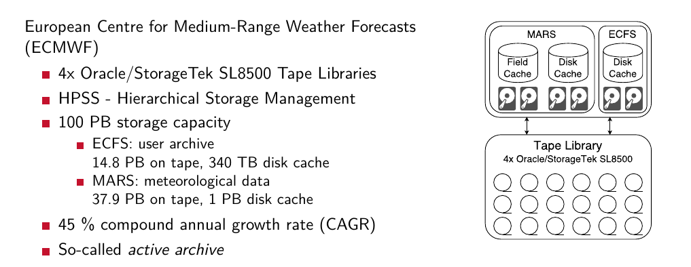
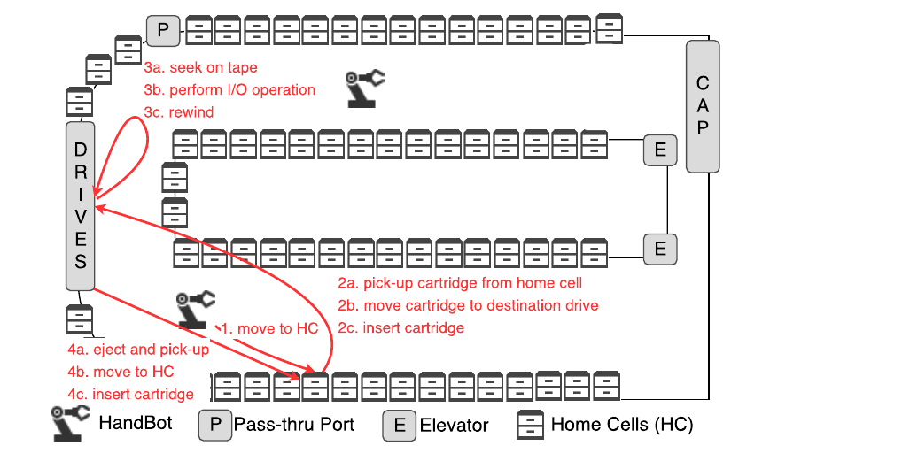
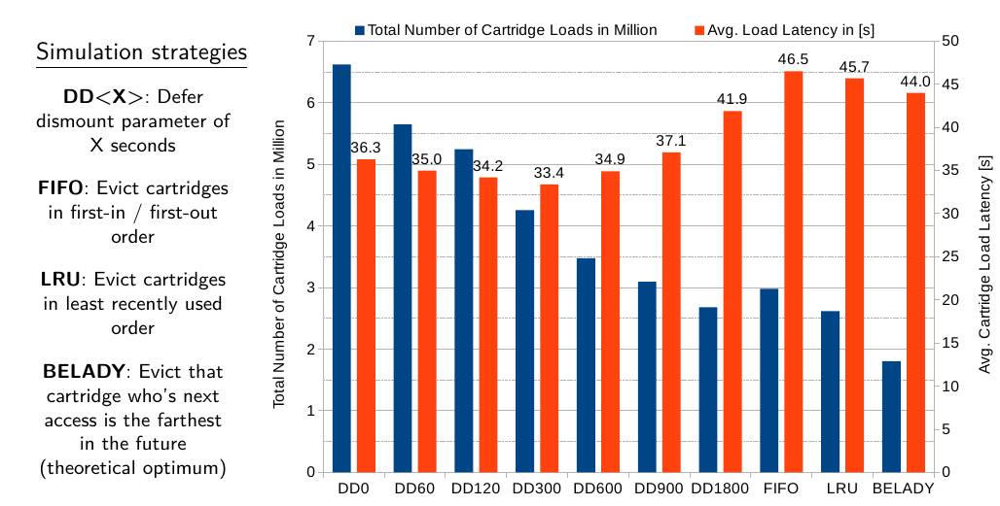
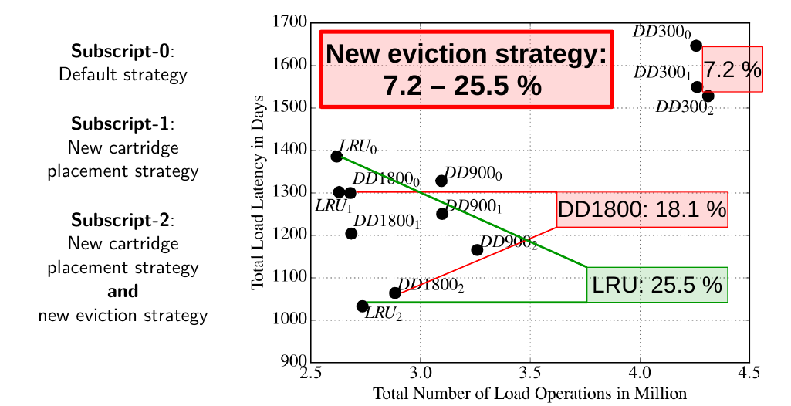
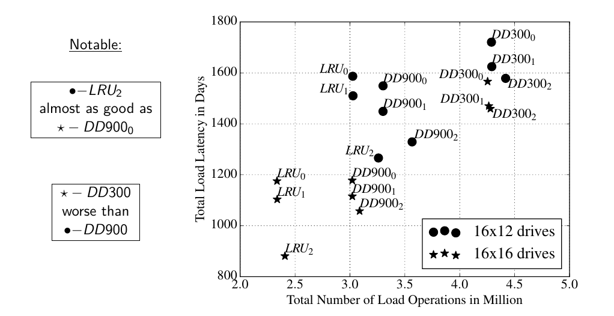

# RoboticTapeLibrary
A RoboticTapeLibrary simulator, based on the Oracle/Storagetek SL8500

## Deprecated 
Development of the simulator will continue at **CERN**. I'll reference the new repository once it's publicly available.

## Simulator

This simulator was developed to analyse the ECMWF data set (available [here](https://www.ecmwf.int/en/computing/our-facilities/data-handling-system/ecmwf-data-handling-log-traces)). 

* **Analysis of the ECMWF Storage Landscape. FAST 2015**
Matthias Grawinkel, Lars Nagel, Markus Mäsker, Federico Padua, André Brinkmann, Lennart Sorth, 15-27, [Fast15](https://www.usenix.org/conference/fast15/technical-sessions/presentation/grawinkel)

* **Simulation and performance analysis of the ECMWF tape library system. SC 2016**
Markus Mäsker, Lars Nagel, Tim Süß, André Brinkmann, Lennart Sorth, 252-263, [SC'16](http://sc16.supercomputing.org/conference-components/technical-program-tues-fri/technical-papers/index.html)

## Preview 

For details refer to the SC16 presentation in docs/sc_maesker.pdf
ECMWF data set:
    

SL8500 scetch:
    

Defer Dismount parameter evaluation:
    

New algorithms evaluation:
    

Drive configuration evaluation:
    
